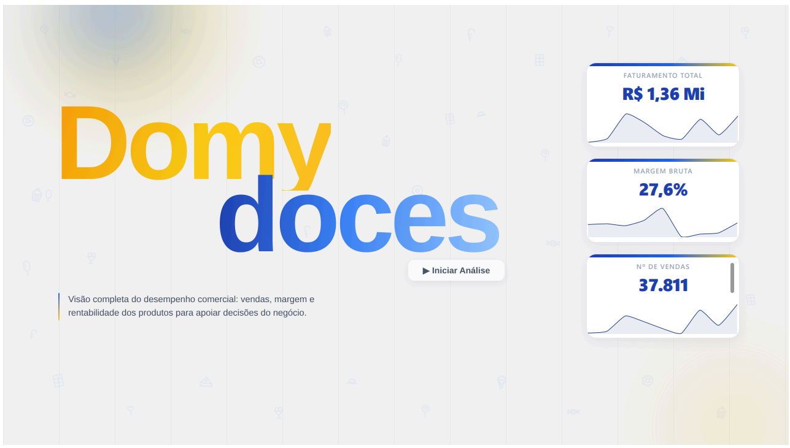
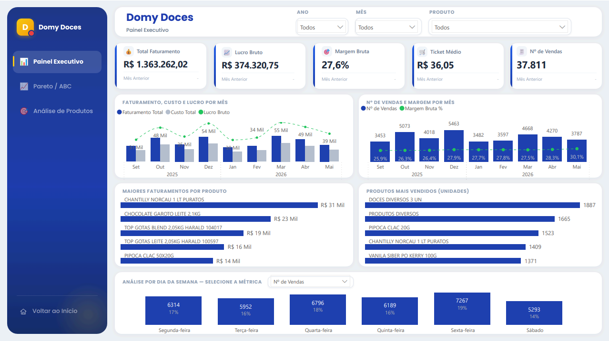
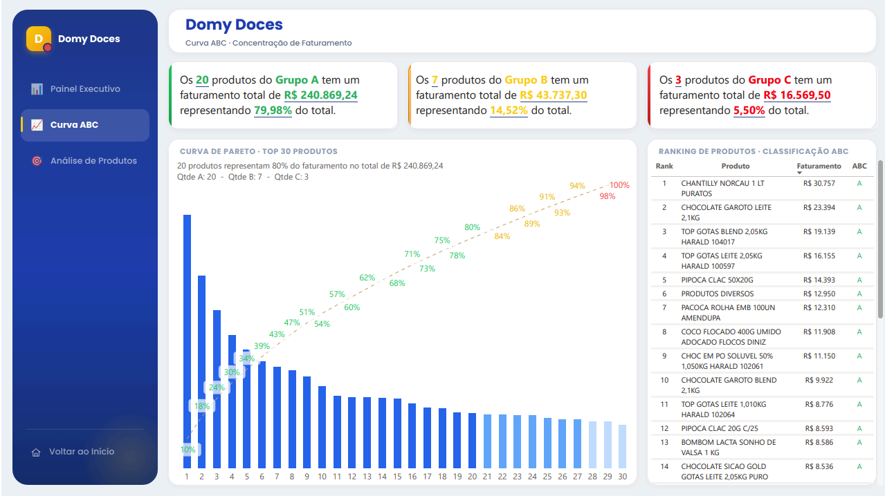
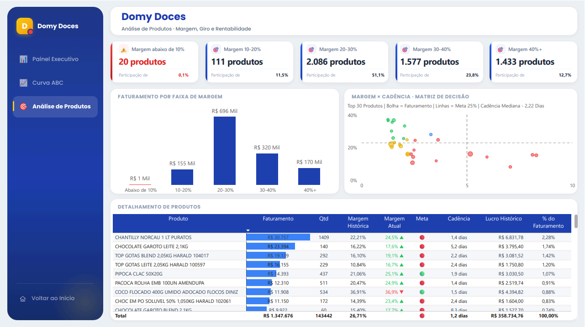

  

<h1 align="center">🍬 Domy Doces — Análise de Vendas</h1>

  <strong>Projeto de análise de dados de ponta a ponta com dados reais de uma loja de doces.</strong> 
  Da planilha bruta do ERP até um dashboard que orienta decisões de negócio.

  
  
  

---

## 🎯 Em uma frase

Peguei os dados de vendas reais de uma loja de doces, presos em planilhas exportadas de um ERP, e construí um pipeline completo que **limpa, modela e transforma esses dados em informação capaz de orientar decisões reais** do negócio.

## 🔧 O que o projeto demonstra

| Etapa | Ferramenta | O que foi feito |
|-------|-----------|-----------------|
| **Extração e Transformação** | Python (pandas) | Limpeza, padronização e tratamento de tipos; separação em Fato e Dimensão |
| **Modelagem** | SQL Server | Star Schema com tabelas tipadas e *views* que centralizam a regra de negócio |
| **Visualização** | Power BI | Dashboard de 3 páginas com métricas confiáveis e leitura orientada à decisão |
| **Governança** | (transversal) | Investigação e correção de problemas de qualidade nos dados |

## 📊 Resultados de negócio que o dashboard revelou

- 💰 **R$ 1,36 milhão** de faturamento analisado em 9 meses (~R$ 151 mil/mês)
- 📈 **Março é o pico do ano**, efeito da Páscoa, a data mais forte da loja
- 📅 **Sexta vende mais, sábado menos**, explicado pelo horário reduzido de sábado
- 🎯 **Nenhum produto passa de 2,26%** do faturamento: baixa dependência, negócio saudável
- 📦 **Mais de 2.400 produtos distintos** vendidos, um catálogo amplo que exige boa gestão de mix
- 🔄 **O campeão gira quase todo dia** (a cada 1,4 dia), o que faz dele a maior alavanca de lucro com pequenos ajustes
- ⭐ O **campeão de vendas tem margem apertada** (~22%), a maior oportunidade de lucro
- ⚠️ **9 produtos vendidos abaixo do custo**, sinalizados para a loja investigar (queima de estoque, erro de preço ou cadastro errado)

## 🖥️ O dashboard

Três páginas, cada uma respondendo a uma pergunta diferente do negócio.

**Painel Executivo** — *como o negócio está indo?* KPIs, evolução mês a mês e padrões de venda na semana e no ano.

**Curva ABC** — *quais produtos realmente sustentam o faturamento?* O princípio de Pareto aplicado ao catálogo para separar o essencial do acessório.

**Análise de Produtos** — *quão rentável é cada item?* Saúde da margem do portfólio e a matriz margem × giro, que aponta exatamente onde mexer para ganhar dinheiro.

## 🕵️ O diferencial: governança de dados

O achado mais importante do projeto não está no dashboard, e sim na investigação: descobri que um cruzamento de dados que "funcionava" estava na verdade **conectando produtos errados** (por um código de barras truncado), gerando centenas de falsos prejuízos. Corrigir isso revelou a margem real e saudável da loja.

> **A lição:** um cruzamento que funciona não é necessariamente um cruzamento correto. Questionar o dado antes de confiar nele é o que separa uma análise confiável de uma análise apenas bonita.

## 📂 Quer ver os detalhes?

Este é o resumo. A **documentação técnica completa**, com os códigos de ETL, a modelagem SQL, as decisões de cada etapa e a leitura completa de cada página do dashboard, está em:

### 👉 **[README_DETALHADO.md](README_DETALHADO.md)**

---

  <em>Python · SQL Server · Power BI</em> 
  Desenvolvido por <strong>Vinícius Braga Bruno</strong>

